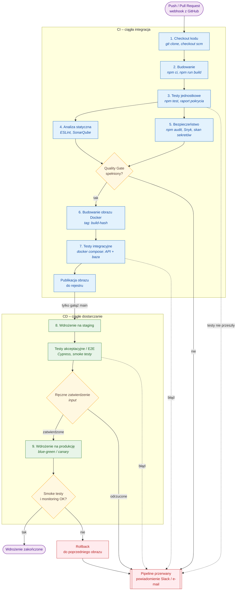

# Pipeline CI/CD w Jenkinsie dla aplikacji webowej

```mermaid
flowchart TD
    trigger([Push / Pull Request<br/>webhook z GitHub]) --> checkout

    subgraph CI["CI – ciągła integracja"]
        checkout["1. Checkout kodu<br/><i>git clone, checkout scm</i>"]
        build["2. Budowanie<br/><i>npm ci, npm run build</i>"]
        test["3. Testy jednostkowe<br/><i>npm test, raport pokrycia</i>"]
        sast["4. Analiza statyczna<br/><i>ESLint, SonarQube</i>"]
        sec["5. Bezpieczeństwo<br/><i>npm audit, Snyk, skan sekretów</i>"]
        gate{"Quality Gate<br/>spełniony?"}
        docker["6. Budowanie obrazu Docker<br/><i>tag: build-hash</i>"]
        integ["7. Testy integracyjne<br/><i>docker compose: API + baza</i>"]
        push["Publikacja obrazu<br/>do rejestru"]

        checkout --> build --> test
        test --> sast & sec
        sast --> gate
        sec --> gate
        gate -- tak --> docker --> integ --> push
    end

    subgraph CD["CD – ciągłe dostarczanie"]
        staging["8. Wdrożenie na staging"]
        e2e["Testy akceptacyjne / E2E<br/><i>Cypress, smoke testy</i>"]
        approve{"Ręczne zatwierdzenie<br/><i>input</i>"}
        prod["9. Wdrożenie na produkcję<br/><i>blue-green / canary</i>"]
        monitor{"Smoke testy<br/>i monitoring OK?"}

        staging --> e2e --> approve
        approve -- zatwierdzone --> prod --> monitor
    end

    push -- tylko gałąź main --> staging
    monitor -- tak --> done([Wdrożenie zakończone])
    monitor -- nie --> rollback["Rollback<br/>do poprzedniego obrazu"]

    fail[["Pipeline przerwany<br/>powiadomienie Slack / e-mail"]]
    test -. testy nie przeszły .-> fail
    gate -- nie --> fail
    integ -. błąd .-> fail
    e2e -. błąd .-> fail
    approve -- odrzucone --> fail
    rollback --> fail

    classDef stage fill:#e3f2fd,stroke:#1565c0,color:#0d47a1
    classDef check fill:#fff8e1,stroke:#f9a825,color:#5d4037
    classDef deploy fill:#e8f5e9,stroke:#2e7d32,color:#1b5e20
    classDef bad fill:#ffebee,stroke:#c62828,color:#b71c1c
    classDef term fill:#f3e5f5,stroke:#6a1b9a,color:#4a148c

    class checkout,build,test,sast,sec,docker,integ,push stage
    class gate,approve,monitor check
    class staging,e2e,prod deploy
    class fail,rollback bad
    class trigger,done term
```
